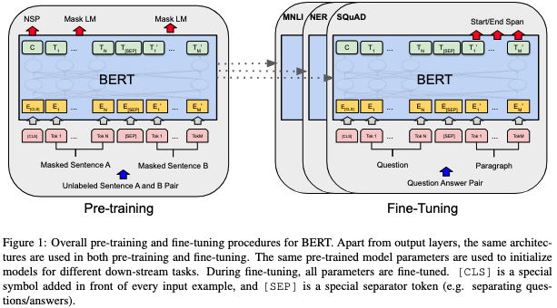
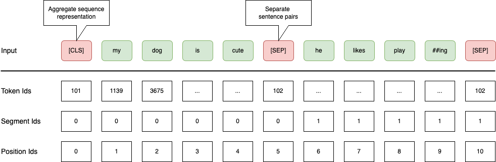
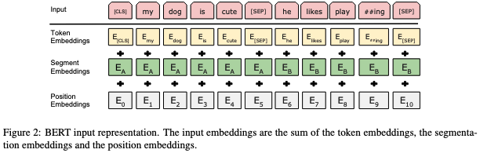

# BERT: Pre-training of Deep Bidirectional Transformers for Language Understanding (Devlin et al., 2018)
Contributor: JiaWei Jiang  
[[paper](https://arxiv.org/abs/1810.04805)]

## Background
Language model **pre-training** has become an integral part for many successful NLP applications. To apply pre-trained language representations to downstream tasks, there exist two common strategies:
* Feature-based: Use pre-computed representations as features ([Peters et al., 2018](https://arxiv.org/abs/1802.05365)).
    * This is also an useful technique in Kaggle competitions.
* Fine-tuning: Introduce and fine-tune task-specific parameters ([Radford et al., 2018](https://cdn.openai.com/research-covers/language-unsupervised/language_understanding_paper.pdf)).

## Challenges
* Standard language models are **unidirectional**.
    * The limitation hinders the model from incorporating context from both directions.
    * A shallow concatenation of left-to-right and right-to-left LMs ignores contextual interaction in hidden layers.

## Contributions
* Propose **BERT** which can learn deep bidirectional language representations.
    * Masked language models (MLM): Jointly conditioned on both left and right context in **all layers**.
    * Next sentence prediction (NSP): Learn the relationship between two sentences.
* Achieve SOTA performance for 11 NLP tasks with an uniform model architecture.
    * Reduce the need for task-specific model architectures.

## Methodology

* The model architecture is a multi-layer bidirectional Transformer **encoder** based on [Vaswani et al.](https://arxiv.org/abs/1706.03762).
    * There are two model sizes:
        * <strong>BERTBASE</strong>: Parameter count 110M, 12 layers, 768 hidden size, 12 heads. Aligned with OpenAI GPT ([Radford et al., 2018](https://cdn.openai.com/research-covers/language-unsupervised/language_understanding_paper.pdf)).
        * <strong>BERTLARGE</strong>: Parameter count 340M, 24 layers, 1024 hidden size, 16 heads.

* The input representation is constructed by summing the following three **learnable** embeddings:
    * Token embeddings (WordPiece)
    * Segment embeddings
    * Position embeddings

* BERT is pre-trained on BooksCorpus and English Wikipedia with two unsupervised tasks:
    * Masked LM (MLM)
        * Mask $15%$ of all WordPiece tokens in each sequence at random.
        * Mitigate the mismatch between pre-training and fine-tuning because `[MASK]` is absent during fine-tuning.
            * Assign `[MASK]` $80%$ of the time.
            * Replace with a random token $10%$ of the time.
            * Remain unchanged $10%$ of the time.
    * Next Sentence Prediction (NSP)
        * Choose a sentence pair `(A, B)` in which `B` is the actual next sentence following `A` $50%$ of the time.

* BERT can be fine-tuned on many downstream tasks involving single text or text pairs.
    * Plug in the task specific inputs and outputs (e.g., classification head).
    * Fine-tune all the parameters without freezing.

## Ablation Studies
### Effect of Model Size
* Increasing the model size will lead to continual improvements on **large-scale** tasks (e.g., machine translation).
* Scaling to extreme model sizes also leads to large improvements on very **small-scale** tasks, provided that the model has been sufficiently **pre-trained**.
### Feature-based Approach with BERT
* Not all tasks can be easily represented by a Transformer encoder architecture. 
* Pre-computing the contextual embeddings can cut down the computational costs for further experiments.

## Discussion
### Does NSP Really Take Effect?

## Terminologies
## References
